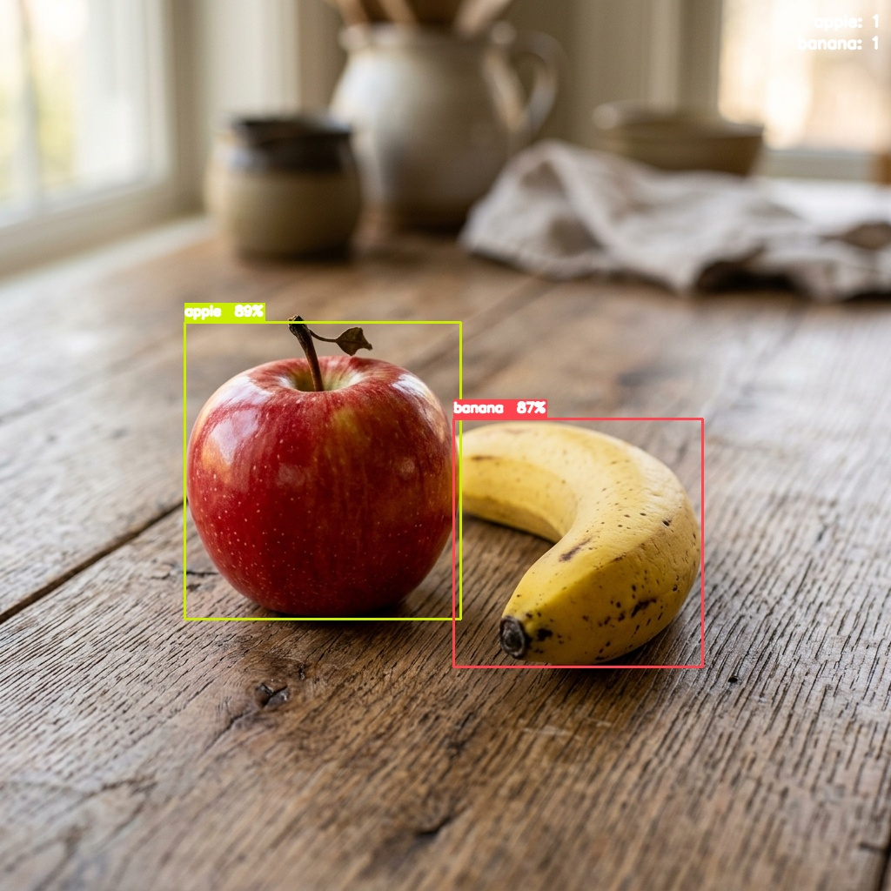
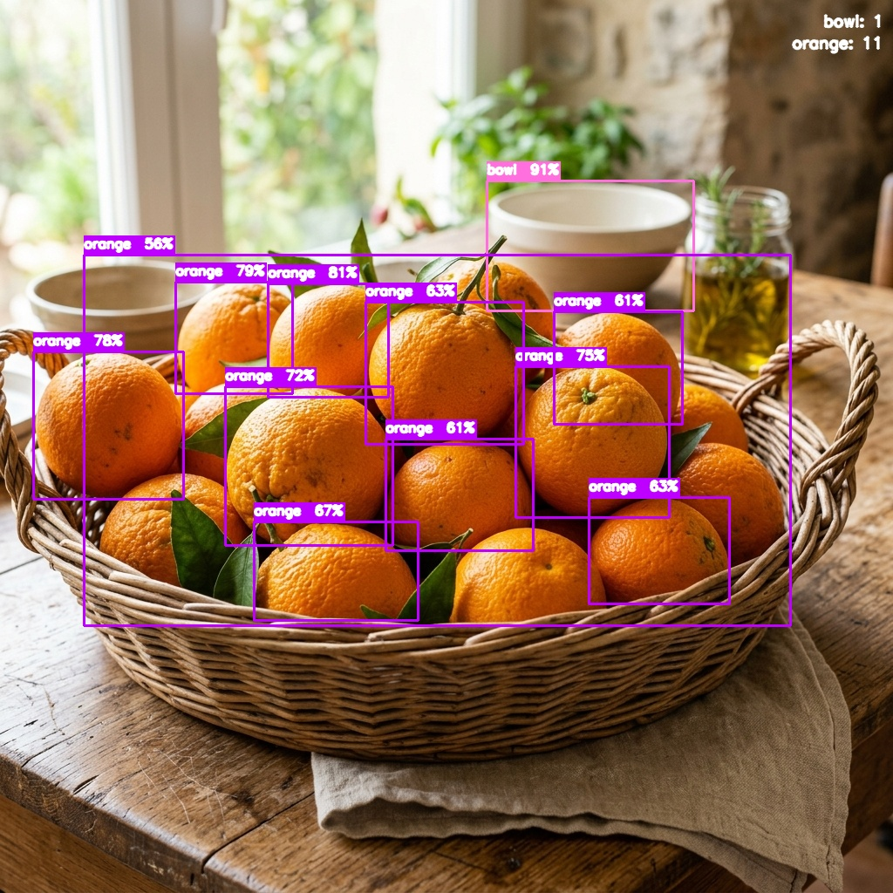

# FrutiLens

**Detecção de Frutas em Tempo Real com YOLOv8**

Sistema de visão computacional para identificação e localização automática de frutas em esteiras industriais.

---

## Sumario

- [Exemplos de deteccao](#exemplos-de-deteccao)
- [O que e este projeto](#o-que-e-este-projeto)
- [O dataset: analise completa](#o-dataset-analise-completa)
- [O problema dos labels e como resolvemos](#o-problema-dos-labels-e-como-resolvemos)
- [Estrutura do projeto](#estrutura-do-projeto)
- [Instalacao](#instalacao)
- [Como usar, passo a passo](#como-usar-passo-a-passo)
  - [Passo 1: gerar os labels](#passo-1-gerar-os-labels)
  - [Passo 2: treinar o modelo](#passo-2-treinar-o-modelo)
  - [Passo 3: validar o modelo](#passo-3-validar-o-modelo)
  - [Passo 4: deteccao em tempo real](#passo-4-deteccao-em-tempo-real)
- [Como o codigo funciona por dentro](#como-o-codigo-funciona-por-dentro)
- [Licenca](#licenca)

---

## Exemplos de deteccao

Abaixo estao alguns exemplos do sistema em funcionamento, processando imagens de teste e identificando as frutas com suas respectivas confiancas:

| Maçã e Banana | Cesta de Laranjas |
|:---:|:---:|
|  |  |

---

## O que e este projeto

Este projeto implementa um sistema de deteccao de frutas em tempo real usando a rede neural YOLOv8. A ideia e posicionar uma camera sobre uma esteira industrial e o sistema identifica automaticamente qual fruta esta passando e onde ela esta na imagem.

**Qual e a diferenca entre classificacao e deteccao?**

- **Classificacao**: o modelo recebe uma imagem e responde "isso e uma maca". Ele nao sabe onde a maca esta.
- **Deteccao**: o modelo recebe uma imagem, identifica todos os objetos presentes e diz onde cada um esta (coordenadas do retangulo ao redor de cada objeto). E isso que precisamos para uma esteira, onde podem passar varias frutas ao mesmo tempo.

**Por que YOLOv8?**

YOLO significa "You Only Look Once" (voce so olha uma vez). O nome descreve a filosofia da rede: ela passa pela imagem uma unica vez e ja retorna todas as deteccoes. Isso a torna muito rapida, capaz de rodar em tempo real (30 a 120 quadros por segundo dependendo do hardware). Alternativas como Faster R-CNN sao mais lentas porque analisam a imagem em duas etapas. Para uma esteira industrial, velocidade e essencial.

---

## O dataset: analise completa

O dataset utilizado e o **Fruits-360**, criado por Mihai Oltean.

**Download:**
> [https://www.kaggle.com/datasets/moltean/fruits?resource=download](https://www.kaggle.com/datasets/moltean/fruits?resource=download)

**Citacao:**
> Mihai Oltean, Fruits-360 dataset, 2017-.

### Numeros do dataset

| Propriedade        | Valor               |
|--------------------|---------------------|
| Total de imagens   | 180.079             |
| Imagens de treino  | 135.071             |
| Imagens de teste   | 45.008              |
| Numero de classes  | 257                 |
| Resolucao          | 100 x 100 pixels    |
| Tipo de fundo      | Branco uniforme     |
| Licenca            | CC BY-SA 4.0        |

### O que tem dentro

O dataset cobre frutas, vegetais, nozes e sementes. Exemplos:

- **Frutas:** Maca (23 variedades), Banana (3 variedades), Laranja, Manga, Pera (10 variedades), Morango, Uva, Limao, Abacate, Pessego, Ameixa, Kiwi, Abacaxi, Melancia, Mamao, Cereja, Melao e muitas outras
- **Vegetais:** Cenoura, Pimentao, Tomate, Berinjela, Batata, Cebola, Abobrinha, Couve-flor, Milho
- **Nozes:** Noz, Avela, Amendoa, Pistache, Castanha-do-caju

### As pastas do dataset

Dentro da pasta `dataset/` existem cinco subpastas. Cada uma e uma versao diferente do mesmo conjunto de imagens:

| Pasta                       | Para que serve                                                                    |
|-----------------------------|-----------------------------------------------------------------------------------|
| `fruits-360_100x100`        | Imagens redimensionadas para 100x100 pixels. **E esta que usamos para treino.**   |
| `fruits-360_original-size`  | Imagens no tamanho original (~400x400). Uteis se quiser mais detalhe.             |
| `fruits-360_multi`          | Imagens com multiplas frutas na mesma foto. Util para testar o modelo treinado.   |
| `fruits-360_3-body-problem` | Um subconjunto menor com 3 tipos: maca, cereja e tomate. Bom para testes rapidos. |
| `fruits-360_meta`           | Metadados, artigos publicados sobre o dataset e dicionario de classes.            |

**Por que usamos a versao 100x100 e nao a original?**

O YOLO redimensiona todas as imagens internamente antes de processar (para 320x320 ou 640x640 dependendo da configuracao). Entao usar a versao 100x100 poupa espaco em disco e torna a geracao dos labels mais rapida, sem perda de qualidade no treino.

---

## O problema dos labels e como resolvemos

### O problema

O Fruits-360 foi criado para **classificacao**, nao para **deteccao**. Isso quer dizer que cada imagem tem uma fruta e a classe e indicada pelo nome da pasta (ex: a pasta `Apple 10` contem fotos de um tipo especifico de maca). Nao existem arquivos dizendo onde a fruta esta dentro da imagem.

Para treinar o YOLO precisamos, para cada imagem, de um arquivo `.txt` com:
- Qual classe e o objeto
- As coordenadas do retangulo (bounding box) ao redor do objeto

Sem isso, o YOLO nao sabe onde olhar. Seria necessario desenhar um retangulo em cada uma das 180.079 imagens manualmente, o que e completamente inviavel.

### A solucao: gerar os labels automaticamente

O Fruits-360 tem uma caracteristica que nos permite resolver isso sem nenhum trabalho manual: **o fundo de todas as imagens e branco puro**.

As frutas foram fotografadas girando em um motor lento, com uma folha de papel branco atras. O autor do dataset criou um algoritmo que removeu o fundo e o substituiu por branco uniforme. Isso significa que qualquer pixel que nao seja branco (R > 240, G > 240, B > 240) pertence a fruta.

Sendo assim, o processo para encontrar o bounding box de cada fruta e simples:

```
1. Carregar a imagem
2. Para cada pixel: se R > 240 E G > 240 E B > 240, e fundo. Caso contrario, e fruta.
3. Encontrar a menor coluna e a maior coluna com pixels de fruta  →  x_min e x_max
4. Encontrar a menor linha e a maior linha com pixels de fruta    →  y_min e y_max
5. Esse retangulo (x_min, y_min, x_max, y_max) e o bounding box da fruta
6. Converter para o formato do YOLO e salvar em um arquivo .txt
```

**Exemplo real** — imagem `Apple 10 / r0_0_100.jpg` (100x100 pixels):

```
Pixels de fundo (brancos) : 2.582 de 10.000 (25,8%)
Pixels da fruta           : 7.418 de 10.000 (74,2%)
Bounding box encontrado   : y de 5 a 95, x de 0 a 99
Label gerado (YOLO)       : 0  0.4950  0.5000  0.9900  0.9000
```

O resultado e 180.079 imagens anotadas automaticamente, com bounding boxes precisos, em poucos minutos.

### O formato YOLO para labels

O YOLO nao usa `x_min, y_min, x_max, y_max` diretamente. Ele usa um formato normalizado:

```
classe  cx  cy  w  h
```

Onde:
- `classe` e o numero inteiro da classe (0 para a primeira, 1 para a segunda, etc.)
- `cx` e o centro horizontal do retangulo, dividido pela largura da imagem (valor entre 0 e 1)
- `cy` e o centro vertical do retangulo, dividido pela altura da imagem (valor entre 0 e 1)
- `w` e a largura do retangulo, dividida pela largura da imagem (valor entre 0 e 1)
- `h` e a altura do retangulo, dividida pela altura da imagem (valor entre 0 e 1)

Normalizar para [0, 1] faz com que o label seja valido independente da resolucao da imagem. Se a imagem for redimensionada de 100x100 para 640x640, o label continua correto.

### Limitacoes e como o treino compensa

O dataset tem caracteristicas artificiais que nao existem no mundo real. Veja como o treino lida com cada uma:

| Limitacao do dataset                  | Como compensamos no treino                                                    |
|---------------------------------------|-------------------------------------------------------------------------------|
| Fundo branco (nao existe em esteliras) | Augmentacoes de cor (HSV) e mosaic misturam as frutas com outros contextos   |
| Uma fruta por imagem                   | Augmentacao mosaic cola 4 imagens juntas, criando cenas com multiplas frutas |
| Resolucao pequena (100x100)            | YOLO redimensiona internamente; aprende as formas independente do tamanho    |
| 257 classes (pode ser demais)          | O script aceita `--classes` para treinar so com as frutas que interessam     |

---

## Estrutura do projeto

```
FrutiLens/
|
|-- README.md               <- Este arquivo. Leia antes de qualquer coisa.
|-- LICENSE                 <- Licenca MIT do projeto.
|-- .gitignore              <- Lista de arquivos que o Git deve ignorar.
|-- requirements.txt        <- Bibliotecas Python necessarias.
|
|-- scripts/                <- Scripts que voce roda uma vez para preparar e treinar.
|   |-- generate_labels.py  <- Gera os labels YOLO automaticamente a partir do Fruits-360.
|   |-- train.py            <- Treina o YOLOv8 com o dataset preparado.
|   `-- validate.py         <- Calcula as metricas do modelo treinado (mAP, Precisao, Recall).
|
|-- src/                    <- Codigo do sistema em uso.
|   `-- detect.py           <- Deteccao em tempo real via webcam, video ou imagem.
|
|-- dataset/                <- (ignorado pelo Git) O Fruits-360 que voce baixou do Kaggle.
|
|-- data/                   <- (ignorado pelo Git) Dataset convertido para o formato YOLO.
|   `-- fruits360_yolo/
|       |-- images/train/   <- Imagens de treino copiadas do Fruits-360.
|       |-- images/val/     <- Imagens de validacao copiadas do Fruits-360.
|       |-- labels/train/   <- Labels .txt gerados automaticamente para treino.
|       |-- labels/val/     <- Labels .txt gerados automaticamente para validacao.
|       |-- classes.txt     <- Lista de todas as classes na ordem correta.
|       `-- fruits360.yaml  <- Arquivo de configuracao que o YOLO le para treinar.
|
`-- runs/                   <- (ignorado pelo Git) Resultados gerados pelo YOLO.
    `-- detect/
        `-- frutilens/
            `-- weights/
                |-- best.pt <- Os melhores pesos salvos durante o treino. Use este.
                `-- last.pt <- Os pesos da ultima epoca. Serve para retomar o treino.
```

**Por que `dataset/` e `data/` sao ignorados pelo Git?**

O dataset completo tem mais de 2 GB. Repositorios Git nao sao feitos para armazenar arquivos grandes. Qualquer pessoa que clonar o projeto precisa baixar o dataset separadamente do Kaggle (link acima) e colocar na pasta correta. O `.gitignore` garante que voce nao vai enviar esses arquivos por acidente.

---

## Instalacao

**Requisitos minimos:**
- Python 3.10 ou superior
- 8 GB de RAM
- GPU com CUDA e recomendado para treino. Para so rodar a deteccao, CPU funciona.

```bash
# 1. Clone o repositorio
git clone https://github.com/seu-usuario/FrutiLens.git
cd FrutiLens

# 2. Instale as dependencias
pip install -r requirements.txt

# 3. Baixe o dataset Fruits-360 no Kaggle:
#    https://www.kaggle.com/datasets/moltean/fruits?resource=download
#    Extraia dentro da pasta dataset/ conforme a estrutura acima.
```

---

## Como usar, passo a passo

### Passo 1: gerar os labels

Este script le todas as imagens do Fruits-360, encontra o bounding box de cada fruta por limiarizacao do fundo branco, e salva os arquivos de label no formato YOLO. Voce so precisa rodar isso uma vez.

```bash
# Gera labels para todas as 257 classes
python scripts/generate_labels.py

# Gera labels apenas para um subconjunto de frutas
# (util para um primeiro treino mais rapido)
python scripts/generate_labels.py \
    --classes "Apple 10" "Apple Golden 1" "Banana 1" "Orange 1" \
              "Mango 1" "Strawberry 1" "Lemon 1" "Kiwi 1" \
              "Pineapple 1" "Watermelon 1" "Peach 1" "Tomato 1"
```

Parametros disponiveis:

| Parametro     | Padrao                                    | Descricao                                              |
|---------------|-------------------------------------------|--------------------------------------------------------|
| `--fruits360` | `dataset/fruits-360_100x100/fruits-360`   | Caminho para a raiz do Fruits-360                      |
| `--output`    | `data/fruits360_yolo`                     | Onde salvar o dataset convertido                       |
| `--classes`   | (todas)                                   | Lista de classes a incluir                             |
| `--threshold` | `240`                                     | Valor de corte para considerar um pixel como branco    |

Saida esperada:

```
============================================================
  FrutiLens - Geracao automatica de labels YOLO
============================================================

  Classes selecionadas: 257
  classes.txt salvo em: data/fruits360_yolo/classes.txt

[1/2] Processando Training...
  OK: 135.071 | Ignoradas: 0

[2/2] Processando Test...
  OK: 45.008 | Ignoradas: 0

  Dataset YAML salvo em: data/fruits360_yolo/fruits360.yaml

============================================================
  Total processadas: 180.079 imagens
  Total ignoradas  : 0
  Classes          : 257
============================================================
```

### Passo 2: treinar o modelo

Este script carrega o dataset gerado no passo anterior e treina o YOLOv8. Ao final, os melhores pesos sao salvos em `runs/detect/frutilens/weights/best.pt`.

```bash
# Treino padrao com YOLOv8n (modelo nano, rapido para testar)
python scripts/train.py

# Treino com YOLOv8s (modelo small, melhor precisao)
python scripts/train.py --model yolov8s.pt --epochs 100 --imgsz 320 --batch 32
```

Parametros disponiveis:

| Parametro    | Padrao          | Descricao                                                     |
|--------------|-----------------|---------------------------------------------------------------|
| `--data`     | (yaml gerado)   | Caminho para o arquivo .yaml do dataset                       |
| `--model`    | `yolov8n.pt`    | Modelo base. Opcoes: n (nano), s (small), m (medium), l (large) |
| `--epochs`   | `50`            | Quantas vezes o modelo vai ver todo o dataset durante o treino |
| `--imgsz`    | `320`           | Resolucao em que as imagens sao processadas internamente       |
| `--batch`    | `32`            | Quantas imagens sao processadas ao mesmo tempo (mais = mais RAM) |
| `--device`   | (automatico)    | `cpu` para forccar CPU, `0` para usar a primeira GPU           |
| `--name`     | `frutilens`     | Nome da pasta onde os resultados serao salvos                  |

**Qual modelo escolher?**

| Hardware          | Modelo     | Batch | imgsz | Epocas | mAP@50 esperado |
|-------------------|------------|-------|-------|--------|-----------------|
| Sem GPU (CPU)     | yolov8n.pt | 16    | 320   | 30     | ~85%            |
| GTX 1060 / 4 GB   | yolov8n.pt | 32    | 320   | 50     | ~88%            |
| RTX 3060 / 12 GB  | yolov8s.pt | 64    | 640   | 100    | ~93%            |
| RTX 3090 / 24 GB  | yolov8m.pt | 128   | 640   | 150    | ~96%            |

O modelo **nano** (n) tem ~3 MB e e o mais rapido. O **small** (s) tem ~11 MB e oferece um bom equilibrio entre velocidade e precisao. Para o artigo, o small e uma boa escolha.

### Passo 3: validar o modelo

Apos o treino, este script calcula as metricas de avaliacao no conjunto de validacao.

```bash
python scripts/validate.py \
    --weights runs/detect/frutilens/weights/best.pt \
    --data data/fruits360_yolo/fruits360.yaml
```

Saida esperada:

```
============================================================
  Resultados:
  mAP@0.50      : 0.9312
  mAP@0.50:0.95 : 0.8754
  Precisao      : 0.9401
  Recall        : 0.9188
============================================================
```

**O que significam essas metricas?**

- **Precisao**: de tudo que o modelo disse ser uma maca, quantas eram realmente macas? Alta precisao significa poucos falsos positivos.
- **Recall**: de todas as macas que existiam na imagem, quantas o modelo encontrou? Alto recall significa poucos falsos negativos.
- **mAP@0.50**: mean Average Precision com limiar de IoU de 50%. E a metrica principal para deteccao de objetos. Quanto mais proximo de 1.0, melhor.
- **mAP@0.50:0.95**: versao mais rigorosa que exige bounding boxes mais precisos.

### Passo 4: deteccao em tempo real

Com o modelo treinado, este script abre a webcam (ou um video) e exibe as deteccoes ao vivo.

```bash
# Webcam (indice 0 e a primeira camera do computador)
python src/detect.py --weights runs/detect/frutilens/weights/best.pt

# Arquivo de video
python src/detect.py --weights best.pt --source video_esteira.mp4

# Imagem estatica
python src/detect.py --weights best.pt --source foto.jpg

# Salvar o resultado em arquivo
python src/detect.py --weights best.pt --source video.mp4 --save --output resultado.mp4
```

Parametros disponiveis:

| Parametro   | Padrao       | Descricao                                                   |
|-------------|--------------|-------------------------------------------------------------|
| `--source`  | `0`          | `0` para webcam, ou caminho de video/imagem                 |
| `--imgsz`   | `640`        | Resolucao de entrada. Menor = mais rapido, menos preciso    |
| `--conf`    | `0.50`       | Confianca minima para mostrar uma deteccao (0 a 1)          |
| `--iou`     | `0.45`       | Limiar de IoU para remover deteccoes duplicadas (NMS)       |
| `--device`  | (automatico) | `cpu` ou `0` para GPU                                       |
| `--save`    | desligado    | Se presente, salva o video com as deteccoes                 |
| `--output`  | `output.mp4` | Caminho do arquivo de saida quando `--save` e usado         |
| `--no-show` | desligado    | Se presente, nao abre janela (util para servidores)         |

Pressione `q` na janela para encerrar.

---

## Como o codigo funciona por dentro

### generate_labels.py

O script percorre todas as pastas de classes dentro de `Training/` e `Test/`. Para cada imagem:

1. Carrega a imagem como um array NumPy de shape `(100, 100, 3)` — altura, largura, canais RGB
2. Cria uma mascara booleana: `True` onde o pixel NAO e branco (pertence a fruta)
3. Encontra as linhas e colunas extremas dessa mascara — esses sao os limites do bounding box
4. Converte para o formato YOLO normalizado
5. Salva o arquivo `.txt` correspondente e copia a imagem para a pasta de destino

Tambem gera o arquivo `fruits360.yaml`, que e o que o YOLO le para saber onde estao as imagens e quais sao as classes.

### train.py

Usa a API da biblioteca Ultralytics para treinar o YOLOv8. As augmentacoes configuradas compensam as limitacoes do dataset:

| Augmentacao   | Valor | Por que esta configurada assim                                    |
|---------------|-------|-------------------------------------------------------------------|
| `hsv_h`       | 0.015 | Pequena variacao de matiz simula diferentes variedades da fruta  |
| `hsv_s`       | 0.70  | Variacao forte de saturacao simula diferentes condicoes de luz   |
| `hsv_v`       | 0.40  | Variacao de brilho simula sombras e reflexos na esteira          |
| `fliplr`      | 0.50  | Flip horizontal: frutas podem vir dos dois lados da esteira      |
| `flipud`      | 0.00  | Sem flip vertical: a esteira tem uma direcao de movimento fixo   |
| `mosaic`      | 1.00  | Cola 4 imagens: cria cenas com multiplas frutas simultaneamente  |
| `mixup`       | 0.10  | Sobreposicao leve de duas imagens, melhora generalizacao         |
| `copy_paste`  | 0.10  | Recorta objetos e cola em outras imagens, cria novas composicoes |

### detect.py

O fluxo principal e:

1. Carrega o modelo a partir do arquivo `.pt`
2. Abre a fonte de video com OpenCV (`cv2.VideoCapture`)
3. Loop: captura frame, passa para `model.predict()`, le os resultados
4. Para cada deteccao, desenha o retangulo e o rotulo na imagem
5. Calcula e exibe o FPS com media movel dos ultimos 30 frames
6. Exibe o contador de frutas detectadas no frame atual
7. Pressionar `q` encerra o loop e libera os recursos

A diferenca principal em relacao ao codigo original do aluno e:
- Tratamento separado para imagem, video e webcam
- Rotulo com fundo colorido (mais legivel)
- Contador de frutas por classe no canto da tela
- FPS calculado como media movel (mais estavel que frame a frame)
- Opcao de salvar a saida em arquivo

---

## Licenca

Este projeto e distribuido sob a **Licenca MIT**. Veja o arquivo [LICENSE](LICENSE).

O dataset **Fruits-360** e licenciado sob **CC BY-SA 4.0** por Mihai Oltean.
Ao usar o dataset em publicacoes, inclua a citacao: Mihai Oltean, Fruits-360 dataset, 2017-.
